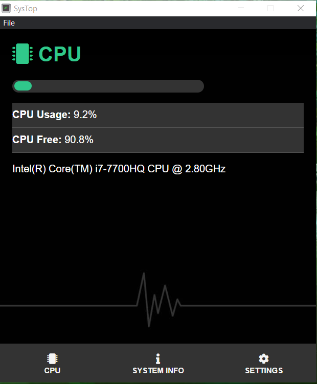
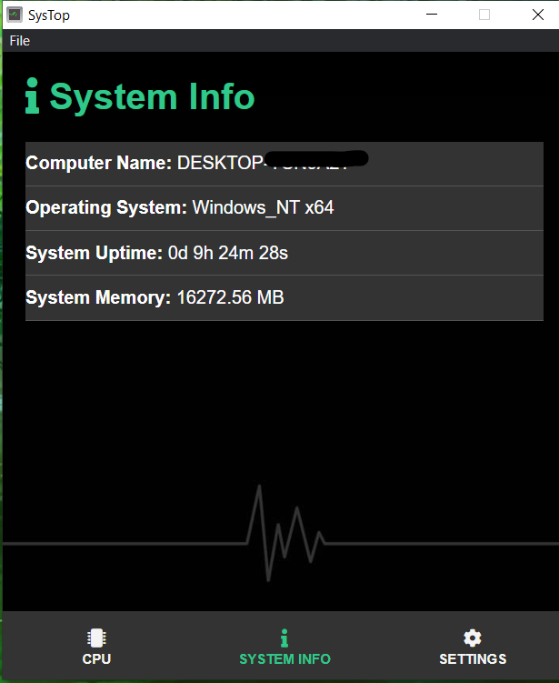
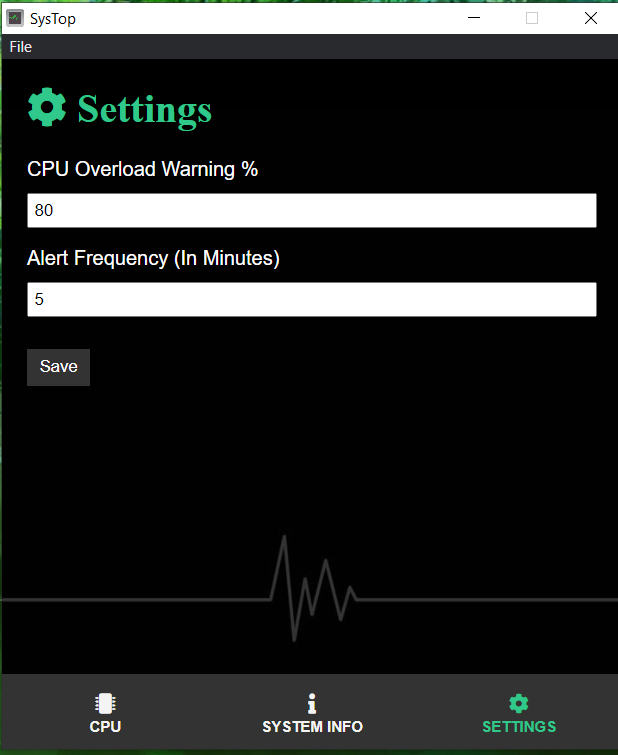

# SysTop App

## What Is This App

This app can display your computer's info, track certain values like your CPU use percentage and warns you when your overreach a certain threshold.

## Technologies Used

- HTML, CSS and vanilla JavaScript.
- Electron.js to package as a desktop application.

## Images

<figure>
    
</figure>
<figure>
 
</figure>
<figure>

</figure>
